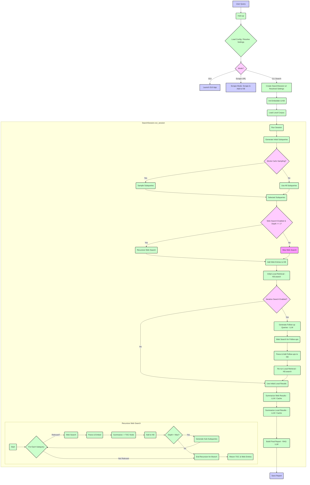

# NanoSage-EG 🧙: Advanced Recursive Search & Report Generation  

Deep Research assistant that runs on your laptop, using tiny models. - all open source!

## How is NanoSage-EG different than other Assistant Researchers?

It offers a structured breakdown of a multi-source, relevance-driven, recursive search pipeline. It walks through how the system refines a user query, builds a knowledge base from local and web data (with optional caching), and dynamically explores subqueries—tracking progress through a Table of Contents (TOC). NanoSage-EG can also perform **iterative searches**, generating follow-up questions based on initial findings to deepen the research automatically.

With Monte Carlo-based exploration, the system balances depth vs. breadth, ranking each branch’s relevance to ensure precision and avoid unrelated tangents. The result? A detailed, well-organized report generated using retrieval-augmented generation (RAG), integrating the most valuable insights.

I wanted to experiment with new research methods, so I thought, basically, when we research a topic, we randomly explore new ideas as we search, and NanoSage-EG basically does that!
It explores and records its journey, where each (relevant) step is a node... and then sums it up to you in a neat report!
Where the table of content is basically its search graph. 🧙

---

## Example Report

You can find an example report in the following link:  
[example report output for query: "Create a structure bouldering gym workout to push my climbing from v4 to v6"](https://github.com/evilgenx/NanoSage-EG/blob/main/example_report.md) <!-- Assuming example report exists in the new repo -->

---

## Quick Start Guide  

### 1. Install Dependencies

1. Ensure **Python 3.8+** is installed.
2. Install required packages (including `PyQt6` for the GUI and other necessary libraries):

```bash
pip install -r requirements.txt

# If you plan to use the SearxNG search provider, you also need:
pip install langchain-community
```

3. *(Optional)* For GPU acceleration, install PyTorch with CUDA:

```bash
pip install torch torchvision torchaudio --index-url https://download.pytorch.org/whl/cu118
```
*(Replace `cu118` with your CUDA version.)*

*Note: `langchain-community` is required if you intend to use the SearxNG search provider (see Configuration below).*

4. Make sure to update pyOpenSSL and cryptography:

```bash
pip install --upgrade pyOpenSSL cryptography
```

---

### 1.5. Launch the GUI (Recommended)

NanoSage-EG includes a graphical user interface (GUI) built with PyQt6 for easier interaction.

1.  **Dependencies**: The required `PyQt6` library is included in `requirements.txt` and installed in the previous step.
2.  **Run the GUI**:
    ```bash
    python main.py --gui
    ```
    This will open the main application window where you can enter your query, configure settings (like web search, embedding model, RAG provider), and start the research process. Results are saved in the `results/` directory.

---


### 2. Set Up Ollama & Pull the Gemma Model

1. **Install Ollama**:

```bash
curl -fsSL https://ollama.com/install.sh | sh
pip install --upgrade ollama
```
*(Windows users: see [ollama.com](https://ollama.com) for installer.)*

2. **Pull Gemma 2B** (for RAG-based summaries):

```bash
ollama pull gemma2:2b
```

---

### 3. Run a Simple Search Query (CLI Mode)

If you prefer the command line, here are some examples:

```bash
# Example using default SearxNG search (ensure SearxNG URL is set in config.yaml or via --searxng_url)
# This performs a recursive search (depth 1), uses local embeddings, and generates a report with Gemma.
python main.py --query "Latest advancements in AI for drug discovery" \
               --web_search \
               --max_depth 1 \
               --device cpu \
               --top_k 10 \
               --embedding_model colpali \
               --rag_model gemma

# Example using DuckDuckGo search provider and a different embedding model
python main.py --query "Create a structured bouldering gym workout to push my climbing from v4 to v6" \
               --web_search \
               --search_provider duckduckgo \
               --max_depth 2 \
               --device cpu \
               --top_k 10 \
               --embedding_model all-minilm \
               --rag_model gemma

# Example: Scrape a single URL and add its content to the knowledge base (runs in scrape mode)
python main.py --scrape-url "https://example.com/some-article" \
               --embedding_model colpali \
               --device cpu

# Example: Run a search and clear the cache beforehand
python main.py --query "Benefits of intermittent fasting" \
               --web_search \
               --clear-cache
```

**Common Parameters**:
- `--query`: Main search query (required for CLI search mode).
- `--gui`: Launches the graphical user interface instead of running in CLI.
- `--config`: Path to the configuration file (default: `config.yaml`).
- `--corpus_dir`: Path to a directory containing local documents for search.
- `--web_search`: Enables web-based retrieval (use `--no-web_search` to disable if default is true in config).
- `--max_depth`: Recursion depth for subqueries (default: 1).
- `--device`: Device for embedding model (`cpu`, `cuda`, or `rocm`).
- `--top_k`: Number of local documents to retrieve.
- `--embedding_model`: Specifies the embedding model (e.g., `colpali`, `all-minilm`, `models/embedding-001`, `openai/text-embedding-ada-002`). Default is defined in `config.yaml`.
- `--rag_model`: Selects the LLM provider for summarization and report generation (`gemma`, `pali`, `gemini`, `openrouter`). `gemma` and `pali` use the Ollama backend. Default in `config.yaml`.
- `--gemma_model_id`: Specific Ollama model ID (e.g., `gemma2:2b`, `llama3:8b`) if using `gemma` or `pali`.
- `--gemini_model_id`: Specific Gemini model ID (e.g., `models/gemini-1.5-flash-latest`) if using `gemini`.
- `--openrouter_model_id`: Specific OpenRouter model ID (e.g., `openai/gpt-3.5-turbo`, `google/gemini-flash-1.5`) if using `openrouter`.
- `--personality`: Optional personality prompt for the RAG LLM (e.g., "scientific", "concise").
- `--search_provider`: Selects the web search engine (`duckduckgo` or `searxng`). Default is `searxng` (defined in `config.yaml`).
- `--searxng_url`: Base URL for your SearXNG instance (required if `search_provider` is `searxng` and not set in config).
- `--search_max_results`: Number of search results to fetch per query. Overrides provider-specific defaults in `config.yaml`.
- `--scrape-url`: URL to scrape and add to the knowledge base. If set, runs in scrape mode instead of search/GUI.
- `--scrape-ignore-robots`: Ignore robots.txt rules when scraping (use with caution).
- `--clear-cache`: Clear the cache database before running.
- `--log-level`: Set the logging level (e.g., `DEBUG`, `INFO`, `WARNING`). Default is `INFO`.

*Settings Hierarchy: Command-line arguments override `config.yaml` settings, which override internal defaults.*

---

### 4. Configure `config.yaml` (Optional)

The `config.yaml` file allows you to set default values for most command-line arguments and configure API keys, search providers, caching, and other settings. The application will create a default `config.yaml` if one doesn't exist.

**Key Sections:**

*   **`general`**:
    *   `corpus_dir`: Default path to local documents (default: `None`).
    *   `device`: Default device (`cpu`, `cuda`, `rocm`) (default: `cpu`).
    *   `max_depth`: Default recursion depth for subqueries (default: `1`).
    *   `web_search`: Whether web search is enabled by default (default: `True`).
*   **`retrieval`**:
    *   `embedding_model`: Default embedding model name (default: `local` - refers to `colpali` or similar small local model).
    *   `top_k`: Default number of local documents to retrieve (default: `3`).
*   **`llm`**:
    *   `rag_model`: Default RAG provider (`gemma`, `pali`, `gemini`, `openrouter`) (default: `gemma`).
    *   `personality`: Default personality prompt for the RAG LLM (default: `"cheerful assistant"`).
    *   `gemma_model_id`: Default Ollama model ID (default: `gemma2:2b`).
    *   `gemini_model_id`: Default Gemini model ID (default: `models/gemini-1.5-flash-latest`).
    *   `openrouter_model_id`: Default OpenRouter model ID (default: `openai/gpt-3.5-turbo`).
    *   `rag_report_prompt_template`: Path to the prompt file used for the final report generation (default points to the standard report prompt). You can change this to use other templates from the `prompts/` directory (see "Choosing the Output Format" below).
    *   *(Note: Several other keys like `selected_gemini_model`, `rag_model_type` exist primarily for GUI state persistence).*
*   **`search`**:
    *   `provider`: Default search provider (`duckduckgo` or `searxng`) (default: `searxng`).
    *   `duckduckgo`:
        *   `max_results`: Default number of results for DuckDuckGo (default: `5`).
    *   `searxng`: (Used if `provider` is `searxng`)
        *   `base_url`: URL of your SearXNG instance (default: `http://127.0.0.1:8080`). **Required if using SearxNG.**
        *   `max_results`: Default number of results for SearxNG (default: `5`).
        *   `language`: Search language code (e.g., `en`) (default: `en`).
        *   `safesearch`: Safesearch level (0=off, 1=moderate, 2=strict) (default: `1`).
        *   `time_range`: Time range filter (e.g., `day`, `week`, `month`, `year`) (default: `None`).
        *   `categories`: Comma-separated list of categories (e.g., `general,news`) (default: `None`).
        *   `engines`: Comma-separated list of enabled engines (defaults to a predefined list).
        *   `enabled_plugins`: List of enabled SearXNG plugins (defaults to a predefined list).
        *   `disabled_plugins`: List of disabled SearXNG plugins (defaults to a predefined list).
        *   *Note: You might need to install `langchain-community` (`pip install langchain-community`) if using `searxng`.*
*   **`api_keys`**: Store `gemini_api_key` and `openrouter_api_key` here instead of using environment variables.
*   **`cache`**:
    *   `enabled`: Enable or disable caching for embeddings and summaries (default: `False`).
    *   `db_path`: Path to the SQLite cache database file (default: `cache/nanosage_cache.db`).

---

### 5. Check Results & Report

### 4. Check Results & Report

A **detailed Markdown report** will appear in `results/<query_id>/`.

**Example**:
```
results/
└── 389380e2/
    ├── Quantum_computing_in_healthcare_output.md
    ├── web_Quantum_computing/
    ├── web_results/
    └── local_results/
```

Open the `*_output.md` file (e.g., `Quantum_computing_in_healthcare_output.md`) in a Markdown viewer (VSCode, Obsidian, etc.).

---

### 5. Advanced Options

#### ✅ Using Local Files

If you have local PDFs, text files, or images:

```bash
python main.py --query "AI in finance" \
               --corpus_dir "my_local_data/" \
               --embedding_model all-minilm \
               --top_k 5 \
               --device cpu
```
*This searches local documents in `my_local_data/` using the `all-minilm` embedding model.*

Now the system searches **both** local docs and web data (if `--web_search` is enabled).

#### 🔄 RAG with Different LLM Providers

You can choose the LLM provider for generating summaries and the final report using `--rag_model`.

**Using Gemma (via Ollama):**

```bash
python main.py --query "Climate change impact on economy" \
               --rag_model gemma \
               --gemma_model_id llama3:8b \
               --personality "scientific"
```
*This uses the `llama3:8b` model (via Ollama) for RAG. If `--gemma_model_id` is omitted, it uses the default specified in `config.yaml` or the internal default (`gemma2:2b`).*

**Using Gemini API:**

1.  **Get an API Key**: Obtain a Gemini API key from [Google AI Studio](https://aistudio.google.com/app/apikey).
2.  **Provide the Key**: You can provide the key in two ways:
    *   **Environment Variable**: Set the `GEMINI_API_KEY` environment variable.
        ```bash
        export GEMINI_API_KEY='YOUR_API_KEY' 
        # Windows: set GEMINI_API_KEY=YOUR_API_KEY
        ```
    *   **Configuration File**: Add the key to your `config.yaml` under `api_keys`:
        ```yaml
        api_keys:
          gemini_api_key: YOUR_API_KEY_HERE 
        ```
3.  **Run with Gemini**: Use the `--rag_model gemini` flag.
    ```bash
    python main.py --query "Latest advancements in renewable energy" \
                   --rag_model gemini \
                   --gemini_model_id models/gemini-1.5-pro-latest \
                   --web_search
    ```
    *If `--gemini_model_id` is omitted, it uses the default from `config.yaml` or the internal default. If no model is specified anywhere and the API key is valid, the application will list available models and prompt you to choose one interactively.*

**Using OpenRouter API:**

1.  **Get an API Key**: Obtain an OpenRouter API key from [OpenRouter.ai](https://openrouter.ai/).
2.  **Provide the Key**: Similar to Gemini, provide the key via:
    *   **Environment Variable**: Set the `OPENROUTER_API_KEY` environment variable.
        ```bash
        export OPENROUTER_API_KEY='YOUR_API_KEY'
        # Windows: set OPENROUTER_API_KEY=YOUR_API_KEY
        ```
    *   **Configuration File**: Add the key to `config.yaml` under `api_keys`:
        ```yaml
        api_keys:
          openrouter_api_key: YOUR_API_KEY_HERE 
        ```
3.  **Run with OpenRouter**: Use the `--rag_model openrouter` flag.
    ```bash
    python main.py --query "Future of AI in education" \
                   --rag_model openrouter \
                   --openrouter_model_id google/gemini-flash-1.5 \
                   --web_search
    ```
    *Specify the desired model using `--openrouter_model_id`. If omitted, it uses the default from `config.yaml` or the internal default (`openai/gpt-3.5-turbo`).*

#### 🚀 Scraping Mode

You can use NanoSage-EG to scrape a single webpage and add its content directly to the knowledge base cache (if enabled) or use it for subsequent searches within the same session (if cache is disabled). This is useful for quickly incorporating specific online articles or resources.

```bash
# Scrape a URL and add its content
python main.py --scrape-url "https://some-website.com/interesting-article" \
               --embedding_model colpali # Specify embedding model if needed

# Ignore robots.txt (use responsibly!)
python main.py --scrape-url "https://some-website.com/another-article" \
               --scrape-ignore-robots
```
*Note: Currently, scraped content added without caching enabled is only available for the duration of the script run. For persistence, enable caching in `config.yaml`.*

#### 💾 Caching

NanoSage-EG can cache embeddings and LLM summarization results to speed up subsequent runs and reduce API calls.

*   **Configuration**: Control caching via the `cache` section in `config.yaml`:
    ```yaml
    cache:
      enabled: true # Set to true to enable caching
      db_path: "cache/nanosage_cache.db" # Path to the cache file
    ```
*   **Clearing Cache**: Use the `--clear-cache` flag when running `main.py` to delete the existing cache database before starting a new session.
    ```bash
    python main.py --query "Your query here" --clear-cache
    ```

#### 🧠 Iterative Search (Experimental)

This feature allows NanoSage-EG to act more like an autonomous agent. After the initial search (web and local), it uses an LLM (the one selected for RAG) to analyze the findings and generate follow-up questions. It then performs web searches for these questions and adds the results to the knowledge base before generating the final report.

*   **Enable**: This feature is currently experimental and needs to be enabled via a setting in `config.yaml` (e.g., add `enable_iterative_search: true` under the `general` section - *Note: This specific key might change, check `search_session.py` for the exact implementation detail if needed*).
*   **Requires RAG Model**: Iterative search requires a valid RAG model (`--rag_model` other than `None`) to generate the follow-up queries.
*   **Process**:
    1.  Initial web/local search runs.
    2.  Top results are summarized for context.
    3.  RAG LLM generates follow-up questions based on the context and initial query.
    4.  Web searches are performed for these follow-up questions.
    5.  New findings are added to the knowledge base.
    6.  Final local retrieval is performed again on the updated knowledge base.
    7.  The final report is generated using all gathered information.

---

### 7. Choosing the Output Format

NanoSage-EG can generate different types of outputs based on the research findings by using different prompt templates located in the `prompts/` directory. You can specify which template to use via the `rag_report_prompt_template` setting in your `config.yaml` file or potentially through future command-line arguments.

Here are the available output formats:

*   **`report.prompt` (Default):** Generates a comprehensive, well-structured report synthesizing information from web and local sources, following the discovered Table of Contents. Includes Introduction, Main Body, Conclusion, and References.
*   **`action_plan.prompt`:** Creates a practical, numbered list of actionable steps or recommendations derived directly from the research findings.
*   **`blog_post.prompt`:** Generates a narrative blog post discussing the research topic and findings in an engaging style.
*   **`checklist.prompt`:** Produces a checklist of items, tasks, or points relevant to the query.
*   **`email_draft.prompt`:** Drafts an email summarizing or discussing the key findings of the research.
*   **`executive_summary.prompt`:** Creates a concise, high-level summary of the research suitable for busy stakeholders.
*   **`faq.prompt`:** Generates a list of frequently asked questions (FAQs) and their answers based on the research data.
*   **`guide.prompt`:** Produces a step-by-step guide or instructional document related to the query topic.
*   **`key_findings.prompt`:** Extracts and lists the most critical insights or discoveries from the research.
*   **`presentation_outline.prompt`:** Generates a structured outline (e.g., using bullet points and indentation) suitable for creating a presentation.
*   **`pros_cons.prompt`:** Lists the advantages (pros) and disadvantages (cons) related to the research topic based on the findings.
*   **`summary.prompt`:** Provides a general summary of the research findings, less structured than the full report.
*   **`swot_analysis.prompt`:** Performs a SWOT analysis (Strengths, Weaknesses, Opportunities, Threats) based on the information gathered about the query topic.

To use a specific format, update the `rag_report_prompt_template` value in your `config.yaml` under the `llm` section:

```yaml
llm:
  # ... other llm settings
  rag_report_prompt_template: prompts/action_plan.prompt # Example: Use the action plan format
```

---

### 6. Troubleshooting

- **Missing dependencies?** Rerun: `pip install -r requirements.txt`
- **Ollama not found?** Ensure it’s installed (`ollama list` shows `gemma:2b`).
- **Memory issues?** Use `--device cpu`. Reduce `--top_k` or `--max_depth`.
- **Too many subqueries?** Lower `--max_depth` to 1.
- **SearxNG connection errors?** Verify the `base_url` in `config.yaml` or `--searxng_url` is correct and your SearxNG instance is running and accessible. Ensure `langchain-community` is installed (`pip install langchain-community`). Check SearXNG logs if possible.
- **Cache issues?** If you suspect outdated cached data is causing problems, run with the `--clear-cache` flag. Ensure the directory containing `cache/nanosage_cache.db` is writable.
- **Incorrect API Key errors (Gemini/OpenRouter)?** Double-check the keys in `config.yaml` or environment variables (`GEMINI_API_KEY`, `OPENROUTER_API_KEY`). Ensure the keys are valid and have the necessary permissions/credits.
- **Slow performance?** Caching (`cache.enabled: true` in `config.yaml`) can help significantly on subsequent runs. Using `--device cuda` (if you have a compatible GPU and PyTorch installed) can speed up embeddings.

---

### 8. Next Steps

- **Try different embedding models** (`--embedding_model all-minilm`).
- **Experiment with different RAG providers and models** (`--rag_model`, `--gemma_model_id`, etc.).
- **Tweak recursion** (`--max_depth`).
- **Tune** `config.yaml` for web search limits, `min_relevance`, API keys, or default models.

---

## Detailed Design: NanoSage-EG Architecture

The application follows a modular design, separating concerns into different packages like `gui`, `search_logic`, `llm_providers`, `embeddings`, `document_parsers`, etc.

### 1. Core Input Parameters

- **User Query**: E.g., `"Quantum computing in healthcare"`. Provided via `--query` in CLI or the GUI input field.
- **CLI Flags** (parsed in `main.py`):
  ```
  --query                 # Required in CLI search mode
  --gui                   # Launch GUI
  --config                # Path to config.yaml
  --corpus_dir            # Path to local documents
  --device                # cpu, cuda, rocm
  --embedding_model       # e.g., colpali, all-minilm
  --top_k                 # Number of local docs
  --web_search / --no-web_search # Enable/disable web search
  --personality           # RAG LLM personality
  --rag_model             # gemma, pali, gemini, openrouter
  --gemma_model_id        # Specific Ollama model
  --gemini_model_id       # Specific Gemini model
  --openrouter_model_id   # Specific OpenRouter model
  --max_depth             # Subquery recursion depth
  --search_provider       # duckduckgo, searxng
  --searxng_url           # SearxNG instance URL
  --search_max_results    # Max results per search query
  --scrape-url            # URL for scraping mode
  --scrape-ignore-robots  # Ignore robots.txt in scrape mode
  --clear-cache           # Clear cache before run
  --log-level             # Set logging level (DEBUG, INFO, etc.)
  ```
- **YAML Config** (`config.yaml`, loaded by `config_utils.load_config`):
  - Sections: `general`, `retrieval`, `llm`, `search`, `api_keys`, `cache`.
  - Defines defaults for most CLI flags.
  - Allows setting API keys directly (`gemini_api_key`, `openrouter_api_key`).
  - Configures search providers (DuckDuckGo, SearxNG options like `base_url`, `engines`, `plugins`).
  - Configures caching (`enabled`, `db_path`).

### 2. Configuration & Session Setup (`main.py`, `search_session.py`)

1. **Configuration Loading (`config_utils.load_config`)**:
   - Reads `config.yaml` (creates default if missing).
   - Merges loaded config with internal defaults (`DEFAULT_CONFIG`).

2. **Settings Resolution (`main.py`)**:
   - Command-line arguments override `config.yaml` values, which override internal defaults.
   - API keys are resolved: `config.yaml` > Environment Variable > `None`.
   - A `resolved_settings` dictionary is created containing the final values for all parameters.
   - Handles interactive selection for Gemini models if needed in CLI mode.

3. **Mode Selection (`main.py`)**:
   - If `--scrape-url` is provided, runs in **Scraping Mode**:
     - Initializes embedder (`embeddings.factory.create_embedder`).
     - Initializes `KnowledgeBase`.
     - Calls `web_scraper.scrape_url_to_markdown`.
     - Adds scraped content to `KnowledgeBase` (persistence depends on caching).
   - If `--gui` is provided, runs in **GUI Mode**:
     - Initializes `PyQt6` application.
     - Loads `gui/style.qss`.
     - Creates and shows `gui.main_window.MainWindow`.
   - Otherwise, runs in **CLI Search Mode**:
     - Initializes `CacheManager` if enabled (`cache_manager.py`).
     - Instantiates `SearchSession` with the user query and `resolved_settings`.

4. **Search Session Initialization (`SearchSession.__init__`)**:
   - Uses the `resolved_settings` dictionary.
   - Sets up `query_id`, `base_result_dir`.
   - **Query Enhancement**: *Note: In the GUI, query enhancement (`llm_providers.tasks.chain_of_thought_query_enhancement`) typically happens *before* the session starts, triggered by user interaction. The `SearchSession` receives the potentially enhanced query.*
   - Initializes the embedder (`embeddings.factory.create_embedder`) using the resolved model name and device, passing the `CacheManager` if available.
   - Initializes the `KnowledgeBase` (`knowledge_base.py`) with the embedder.
   - Computes the embedding for the (potentially enhanced) query using `embedder.embed()`.
   - Loads local documents into the `KnowledgeBase` if `corpus_dir` is provided (`kb.build_from_directory`).

### 3. Recursive Web Search & TOC Tracking (`SearchSession.run_session`, `search_logic/web_recursive.py`, `search_logic/subquery.py`)

1.  **Initial Subquery Generation**:
    *   `search_logic.subquery.generate_initial_subqueries` creates initial search topics from the (enhanced) query.
    *   *(Optional)* `search_logic.subquery.perform_monte_carlo_subqueries` samples these based on relevance and configuration.
2.  **Recursive Expansion (`search_logic.web_recursive.perform_recursive_web_searches`)**:
    *   Iterates through selected subqueries up to `max_depth`.
    *   For each subquery:
        *   Computes relevance score against the main query embedding. Skips if below threshold (`min_relevance` in config, not currently exposed via args).
        *   Creates a `TOCNode` (`toc_tree.py`) to track this branch.
        *   Performs web search using the selected provider (`web_search.py`).
        *   Parses results (`document_parsers/`) and embeds content using the session's `embedder`.
        *   Summarizes content using the selected RAG provider (`search_logic.summarization.summarize_web_results`), potentially using the `CacheManager`. Stores summary in `TOCNode`.
        *   Adds parsed web content (text + embedding) to the `KnowledgeBase`.
        *   If `current_depth < max_depth`, generates follow-up sub-subqueries (`llm_providers.tasks.generate_followup_queries`) and recursively calls the expansion function.
    *   Builds the hierarchical `toc_tree` list.

### 4. Local Retrieval & Iterative Refinement (`SearchSession.run_session`, `KnowledgeBase.search`, `llm_providers.tasks.generate_followup_queries`)

1.  **Initial Local Retrieval**:
    *   `KnowledgeBase.search()` retrieves the `top_k` most relevant documents (from local files and previously added web content) based on the (enhanced) query embedding.
2.  **Iterative Search (if enabled)**:
    *   Summarizes context from initial web/local results.
    *   Uses the RAG LLM (`llm_providers.tasks.generate_followup_queries`) to generate new questions based on the context.
    *   Performs simple web searches (currently DDG) for these follow-up questions.
    *   Parses and embeds new results, adding them to the `KnowledgeBase`.
    *   **Re-runs Local Retrieval**: `KnowledgeBase.search()` is called again to retrieve the `top_k` documents from the *updated* knowledge base.

### 5. Summarization & Final Report Generation (`search_logic/summarization.py`, `search_logic/reporting.py`)

1.  **Summarization**:
    *   `search_logic.summarization.summarize_web_results` summarizes content associated with the TOC nodes (uses RAG LLM, potentially cached).
    *   `search_logic.summarization.summarize_local_results` summarizes the final set of retrieved local documents (uses RAG LLM, potentially cached).
2.  **Report Building (`search_logic.reporting.build_final_answer`)**:
    *   Constructs the final prompt using the template specified in `resolved_settings['llm']['rag_report_prompt_template']`.
    *   Includes the (enhanced) query, TOC structure, web summaries, local summaries, and reference links.
    *   Calls the appropriate RAG provider function (e.g., `llm_providers.ollama.call_ollama`) using the `resolved_settings` (provider, model ID, API key, personality).
3.  **Saving Report (`search_logic.reporting.save_report`)**:
    *   Saves the generated Markdown report, along with intermediate files (web results, local results snippets), to the `results/<query_id>/` directory.

### 6. Balancing Exploration vs. Exploitation

- Subqueries with **relevance_score < min_relevance** (config setting) are skipped during recursive search.
- `max_depth` limits the recursion depth.
- **Monte Carlo** sampling (optional, enabled by default in config) focuses initial exploration on more promising subqueries.
- **Iterative Search** (optional) allows targeted exploration based on initial findings.

### 7. Final Output

- A **detailed Markdown report** in `results/<query_id>/` synthesizing information from all relevant sources (web, local, iterative), structured according to the generated Table of Contents.

---

## Summary Flow Diagram




If you found **NanoSage-EG** useful for your research or project - or saved you 1 minute of googling, please consider citing it:  

**BibTeX Citation:**  
```bibtex
@misc{NanoSage-EG,
  author = {Foad Abo Dahood, evilgenx}, 
  title = {NanoSage-EG: A Recursive, Relevance-Driven Search and RAG Pipeline},
  year = {2025},
  howpublished = {\url{https://github.com/evilgenx/NanoSage-EG}},
  note = {Accessed: \today}
}
```

**APA Citation:**  
Foad, Abo Dahood & evilgenx. (2025). *NanoSage-EG: A Recursive, Relevance-Driven Search and RAG Pipeline*. Retrieved from [https://github.com/evilgenx/NanoSage-EG](https://github.com/evilgenx/NanoSage-EG)
